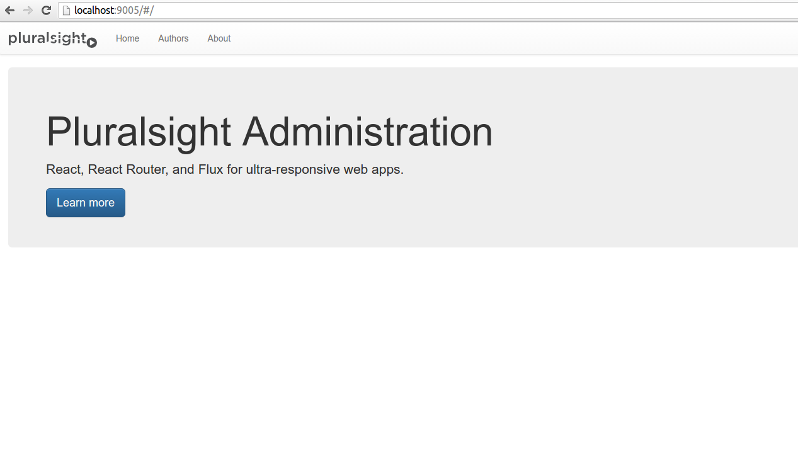
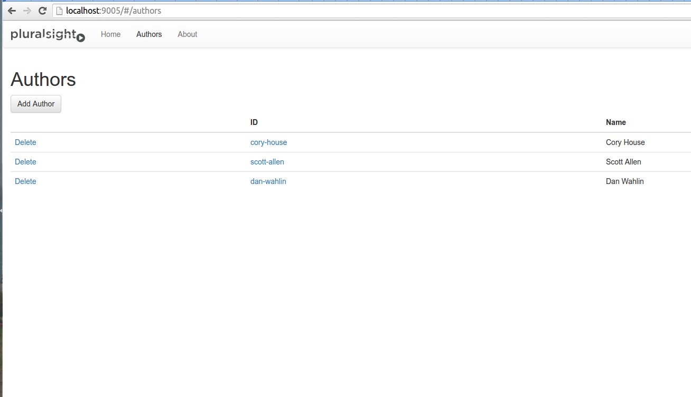

# React-Flux-Course-Website

This is a sample course web application built mainly using React and Flux following a course on [PluralSight](http://www.pluralsight.com/author/cory-house) 

##Main Technical Features are listed as follows:
- React, React Router, and Flux for ultra-responsive UI development  
- Browserify bundling  
- jQuery with Bootstrap for styling  
- Gulp build that:  
-- compiles JSX  
-- lints JSX and JS via ESLint  
-- bundles JS and CSS files  
-- migrates the built app to the dist folder  
-- runs a dev webserver  
-- opens your browser at the dev URL  
-- reloads the browser upon save  

##To get started:  
1. Install [NodeJS](http://www.nodejs.org)  
2. Download this repo 
3. Open the command line of your choice and cd to the root directory of this repo on your machine  
4. `npm install` - Installs packages
5. `npm install -g gulp` - Installs gulp globally. [Why globally?](http://stackoverflow.com/questions/22115400/why-do-we-need-to-install-gulp-globally-and-locally)
5. `gulp` - Builds the project and opens your browser. 
6. Navigate to [http://localhost:9005/](http://localhost:9005/) if your browser doesn't open automatically.

##Having Issues? Try this:
1. If you have an .eslintrc file in your user directory, delete it.
2. Contact me through my [email](kevlai22@uw.edu)